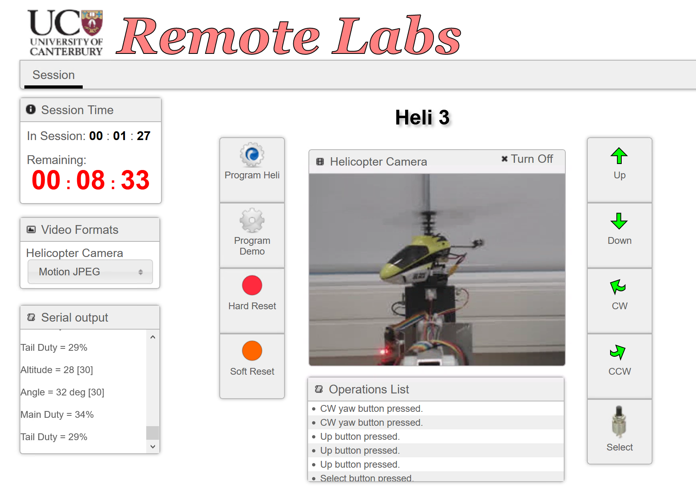

# **Project Percival** - Thu_AM_group_1

> Caitlin Bergervoet - 58922711  
> Owen Plant -  25494036  
> Narottam Royal - 35185738

- - -

## Project Description
This repository contains the source code for the helicopter project in ENCE361. The project was based around the Tiva C Series  [TM4C123G LaunchPad](http://www.ti.com/tool/EK-TM4C123GXL) and the associated [Orbit BoosterPack](https://reference.digilentinc.com/orbit_boosterpack/orbit_boosterpack).

Inspiration for this project was taken from the [Percival P.74](https://en.wikipedia.org/wiki/Percival_P.74), an innovative and experimental tip-jet rotor helicopter design that completely failed.
Unlike the Percival, our helicopter was able to fly, but we stayed true to the highly innovative design of the Percival by using FreeRTOS and implementing automatic offset detection in our altitude controller.



The designed controller uses two PI controllers to control the main and tail rotors of the helicopter. The controller references are ramped between the current and desired references to help with stability.
Other notable design features include gain clamping, quadrature decoding and ADC sampling and averaging. The height, yaw and rotor duty cycles of the helicopter are transmitted over UART and shown on the OLED display. 

Several [libraries](https://eng-git.canterbury.ac.nz/nro55/tiva-libraries) for the Tiva C series were used:

* TivaWare
* OrbitOLED
* FreeRTOS
* TraceRecorder

## Setup

Download and install the following software:

* [vscode](https://aka.ms/win32-x64-user-stable)
* [git](https://git-scm.com/download/win)
* [cmake](https://cmake.org/download/)
* [make](https://github.com/mbuilov/gnumake-windows)
* [lmflash](http://www.ti.com/tool/LMFlashProgrammer) - programming
* [openocd](http://gnutoolchains.com/arm-eabi/openocd/) - debugging
* [arm embedded toolchain](https://developer.arm.com/-/media/Files/downloads/gnu-rm/8-2018q4/gcc-arm-none-eabi-8-2018-q4-major-win32-sha2.exe?revision=169eed21-7cbc-48c6-a289-f39d95bd634c?product=GNU%20Arm%20Embedded%20Toolchain,32-bit,,Windows,8-2018-q4-major)

### Configure Visual Studio Code

Install the following extensions:

```
code --install-extension ms-vscode.cpptools twxs.cmake
code --install-extension twxs.cmake
code --install-extension vector-of-bool.cmake-tools
code --install-extension marus25.cortex-debug
```

### Configure Repository

```
git clone https://eng-git.canterbury.ac.nz/nro55/ence361-week3.git
code ence361-week3
```

Once VS Code opens, select ```GCC for arm-none-eabi``` as the active kit.

Select ```CMake: Debug``` to configure the CMake and then click ```Build``` to build the project - this creates a .axf file which is used for debugging.  
Changing the target from ```[all]``` to ```[program]``` will create the necessary .bin file and program the Tiva board.

Remote debugging with OpenOCD can be accessed by selecting the debug tab (```ctrl+shift+d```), selecting ```Debug (OpenOCD)``` and clicking the ```Start Debugging``` button.

## Continuous Integration
GitLab continuous integration is used to automatically configure and build the project.
The process generates a binary file (heli.bin) which can be used to program the helicopter rigs and an object file (heli.axf) which is useful for debugging.

The repository will have a green tick if the code can successfully be compiled. If a commit is not able to be compiled, the repository displays a red cross and an email notification is sent to the user who pushed the broken commit.